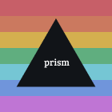

<div align="center">
  
</div>

## Install

Requires [telescope.nvim](https://github.com/nvim-telescope/telescope.nvim)


- lazy.nvim

```lua
{
    "chadcat7/prism",
    lazy = true,
    events = {"UIEnter"},
    config = function()
        require("prism"):setup({
            currentTheme = "onedarker",
            reset = false,
        })
    end
}
```
## Configuration

```lua
require("prism"):setup({
  customSchemes = {
    -- Add any number of schemes here
    {
      name = "serenade",
      background = "#23282b",
      foreground = "#cde5c3",
      cursorline = "#272b2f",
      comment = "#767b82",
      darker = "#1e2124",
      cursor = "#bfddb2",
      black = "#23282b", -- useful when background is transparent
      color0 = "#2E3338",
      color1 = "#d76e6e",
      color2 = "#ACB765",
      color3 = "#e5a46b",
      color4 = "#82abbc",
      color5 = "#d39bb6",
      color6 = "#87c095",
      color7 = "#bfddb2",
      color8 = "#373D41",
      color9 = "#d76e6e",
      color10 = "#ACB765",
      color11 = "#e5a46b",
      color12 = "#82abbc",
      color13 = "#d39bb6",
      color14 = "#87c095",
      color15 = "#cfe0c7",
    },
  },
  currentTheme = "serenade",
  reset = true, -- applies the currentTheme everytime neovim is opened
  -- currentTheme = "onedarker",
  customFiles = vim.fn.stdpath "config" .. "/lua/hls",
  transparent = false,
  reload = { "lualine" }, -- modules to be reloaded everytime theme is set 
})
```
- If a theme with the same name is already included in the defaults, theme specified by the user will be given preference

- For using custom highlights, make files in the `customFiles` folder. For example

```lua
-- .config/nvim/lua/hls/alpha.lua
-- you can name the file however you want, because all the files in lua/hls would be read 

local utils = require("prism.utils")
local colors = require("prism.themer"):getColors()

return {
  AlphaHeader = { fg = colors.color4, bg = colors.background },
  AlphaLabel = { fg = colors.color7, bg = colors.background },
  AlphaIcon = { fg = colors.color5, bold = true, },
  AlphaKeyPrefix = { fg = colors.color1, bg = utils.darken(colors.color1, colors.black, 0.04) },
  AlphaMessage = { fg = colors.color2, bg = colors.background },
  AlphaFooter = { fg = colors.comment, bg = colors.background },
}
```

### Minimal Configuration

```lua
require("prism"):setup({
  reset = true, -- applies the currentTheme everytime neovim is opened
  currentTheme = "onedarker",
  reload = { "lualine" }, -- modules to be reloaded everytime theme is set 
})
```
But yes calling the setup function atleast once is important!


## Preinstalled themes

+ Aquarium
+ Ayu
+ Cosmicdecay
+ Cat 
+ Decay
+ Dracula
+ Everblush 
+ Everforest
+ Fox
+ Ghost
+ Groove
+ Gruv
+ Github
+ Horizon
+ Kanagawa
+ Kizu
+ Material Dark 
+ Monokai Pro
+ Mountain
+ Nirvana
+ Nord
+ Onedarker
+ Onenord
+ Oxo
+ Radium
+ Serenade
+ Serenity
+ Sweetpastel
+ Synthwave84
+ Tokyodull
+ Tundra
+ Verdant
+ Vixima
+ Vscodedull
+ Yata
+ Yoru

## Telescope picker

There is telescope picker included with this config. Shows the default and as well as the user defined colorschemes. Invoke it by

```
:PrismTelescope
```

## Commands

For setting theme without the picker - 

```
:PrismSet <themename>
```

For setting random theme - 

```
:PrismRandom
```

## Utils

For even more options for coloring, a bunch of methods have been provided in `prism.utils`.

- `M.darken(hex, bg, amount)`
- `M.lighten(hex, fg, amount)`
- `M.mix(hex1, hex2, weight)`
- `M.saturate(hex1, factor)`
- `M.moreRed(hex1, factor)`
- `M.moreGreen(hex1, factor)`
- `M.moreBlue(hex1, factor)`
- `M.warm(hex1, factor)`
- `M.cold(hex1, factor)`

## Supported Plugins

- [lualine](https://github.com/nvim-lualine/lualine.nvim)
- [bufferline](https://github.com/akinsho/bufferline.nvim)
- [barbecue](https://github.com/utilyre/barbecue.nvim)
- [nvim-cmp](https://github.com/hrsh7th/nvim-cmp)
- [nvim-tree](https://github.com/kyazdani42/nvim-tree.lua)
- [telescope](https://github.com/nvim-telescope/telescope.nvim)
- [treesitter](https://github.com/nvim-treesitter/nvim-treesitter)
- [whichkey](https://github.com/folke/which-key.nvim)
- [devicons](https://github.com/rcarriga/nvim-notify)
- [harpoon](https://github.com/ThePrimeagen/harpoon)
- [hop](https://github.com/phaazon/hop.nvim)
- [notify](https://github.com/rcarriga/nvim-notify)

### Todo

- [x] Custom highlights
- [x] Transparency
- [x] Some default themes
- [x] More color related functions
- [x] Telescope Prompt
